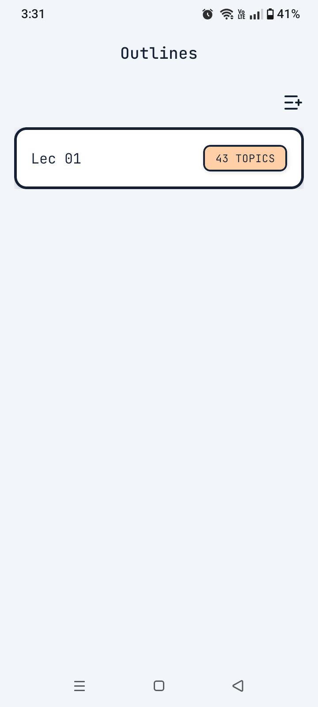
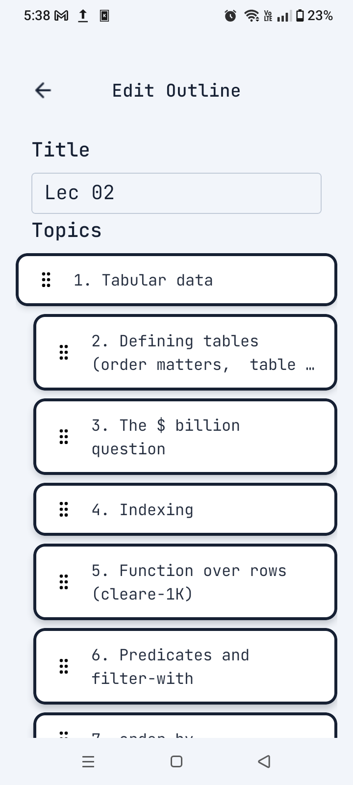
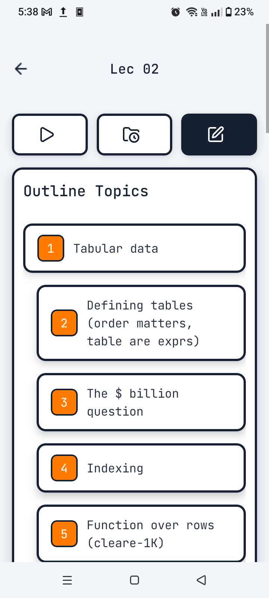
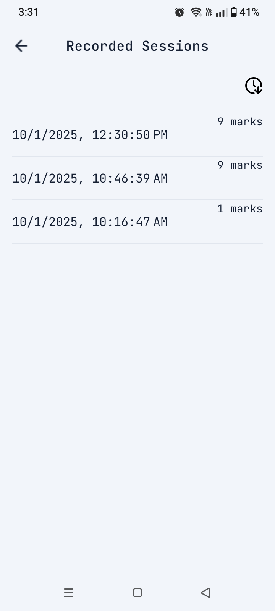
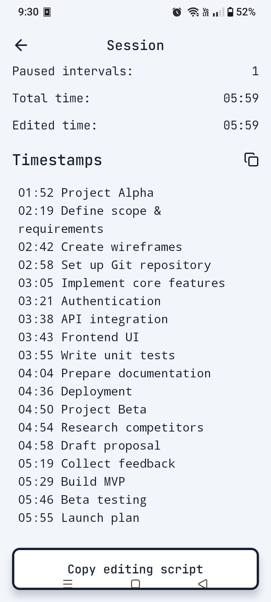
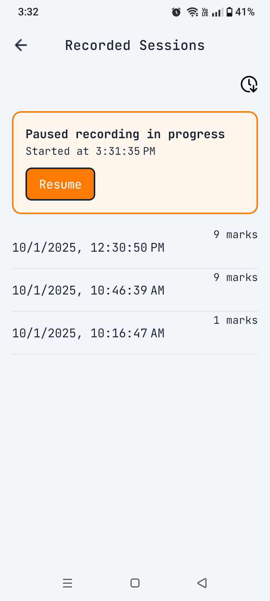
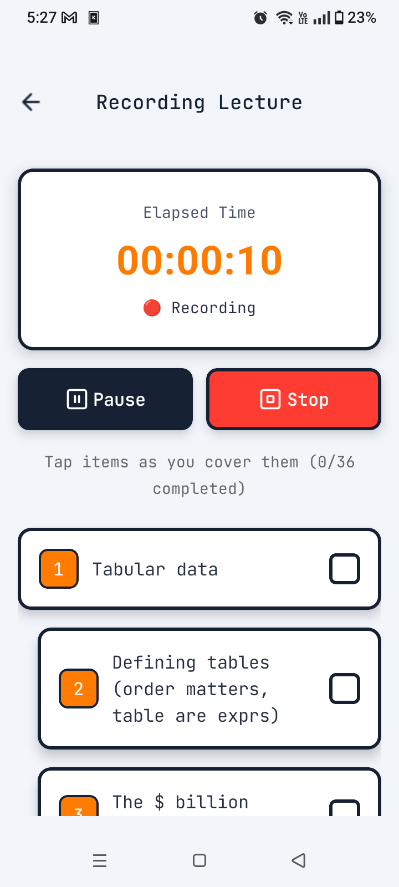
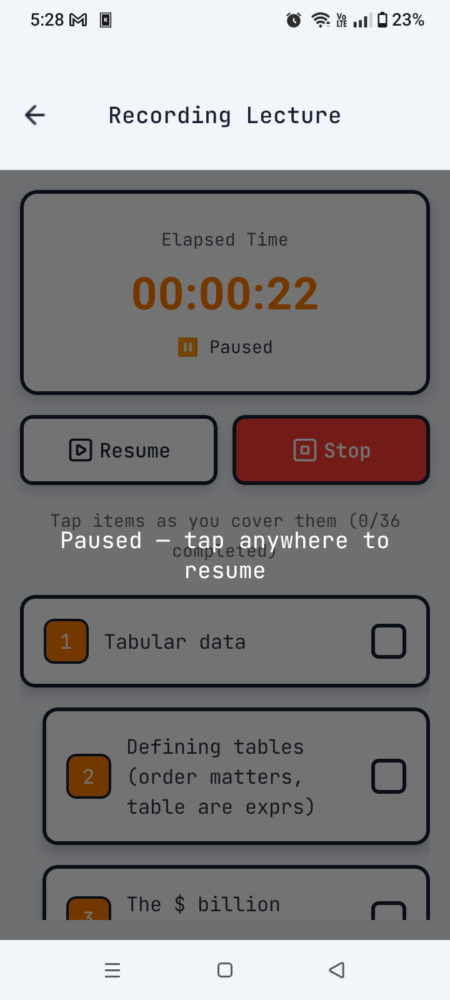

# Stamper

A micro app that helps with post-processing of lectures' recordings. It outputs a `ffmpeg` command that removes the pauses and `YouTube` compatible timestamps. The idea origninated from me forgetting to resume the recording after getting interrupted. So I just leave the recording running and the app generates a ffmpeg command that removes the pauses. It also saves me time by generating the `YouTube` chapters.

## Screenshots

| Outlines List                                                                        | Outline Editor                                                                                    | Outline Preview                                                                      | Lecture Sessions                                                                        |
| ------------------------------------------------------------------------------------ | ------------------------------------------------------------------------------------------------- | ------------------------------------------------------------------------------------ | --------------------------------------------------------------------------------------- |
|  |  |  |  |

| Session Screen                                                                      | Resume Session                                                                                    | Recording                                                                          | Paused Recording                                                                                        |
| ----------------------------------------------------------------------------------- | ------------------------------------------------------------------------------------------------- | ---------------------------------------------------------------------------------- | ------------------------------------------------------------------------------------------------------- |
|  |  |  |  |
